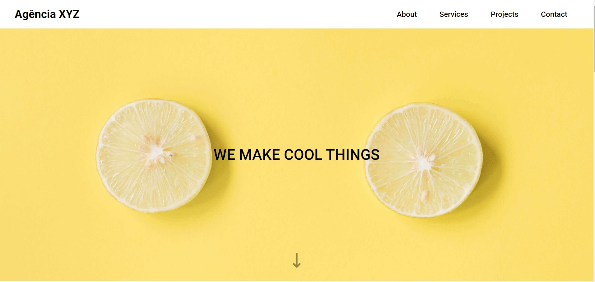
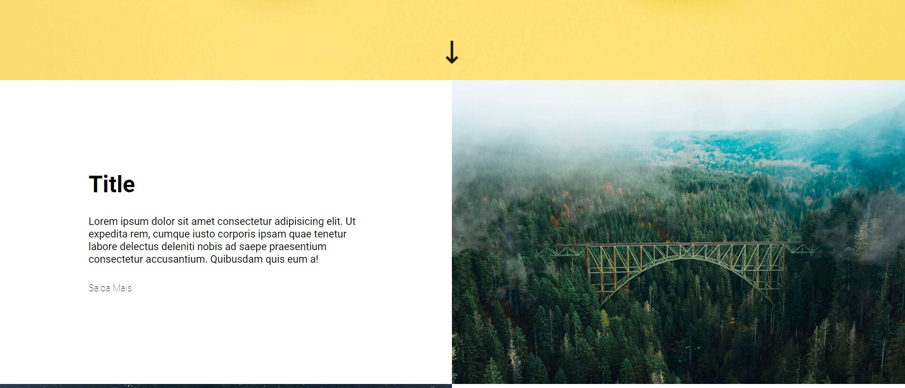
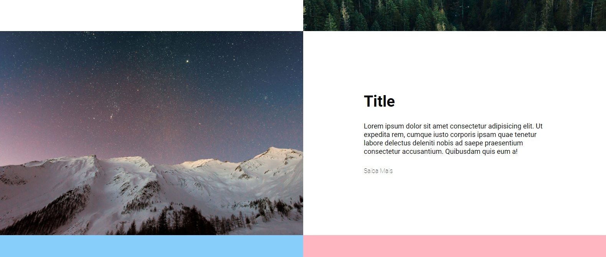
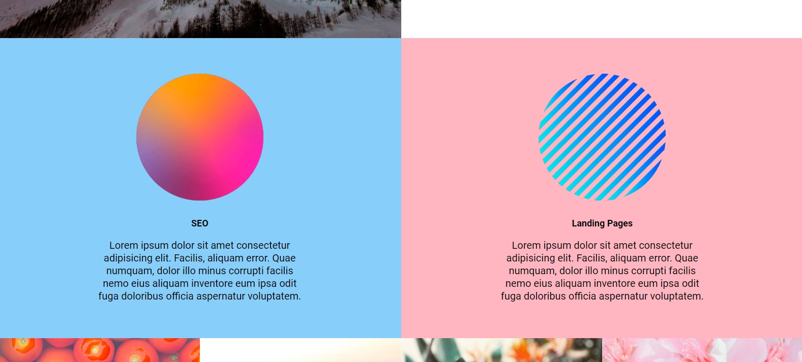
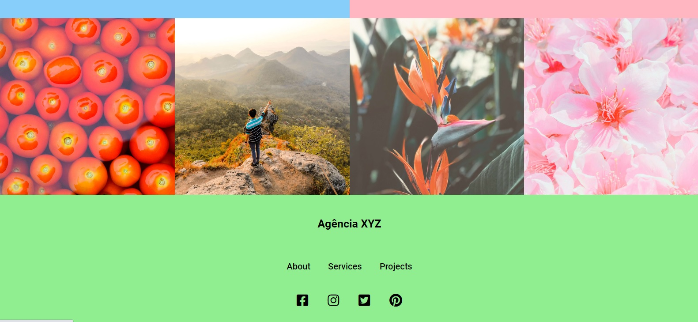
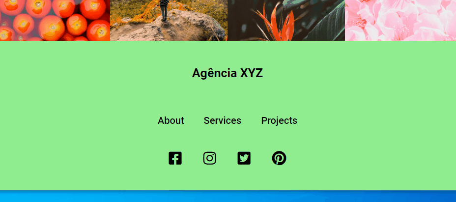
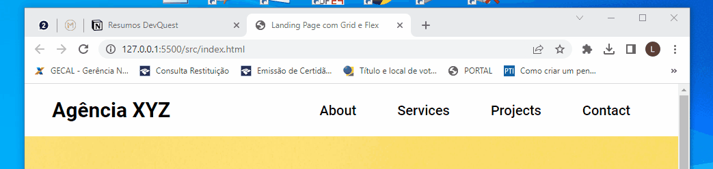

# README - Projeto Landing Page - DevQuest
Projeto desenvolvido no curso DevQuest, feito totalmente usando as linguagens HTML e CSS 🚀🚀 

Abaixo estão as imagens do layout do projeto após sua finalização:

- Layout Projeto
[]

[]

[]

[]

[]

Vídeos de Alguns Menus em Funcionamento

[]

[]

[]

## Tecnologias Utilizadas
- HTML
- CSS

## Desafios
Tivemos dificuldade no uso do BEFORE/AFTER, além do uso das Media Queries para deixar o projeto responsivo. Tivemos certa dificuldade em desenvolvermos o menu no topo do nosso site com relação ao uso em telas pequenas (menu hamburguer).

## O que aprendemos
Aprendemos novas maneiras de posicionarmos nossos elementos dentro do layout do site usando o FLEX e o GRID. Aprendemos também a desenvolver novo estilo de menu a ser usado em telas menores (menu hamburguer)